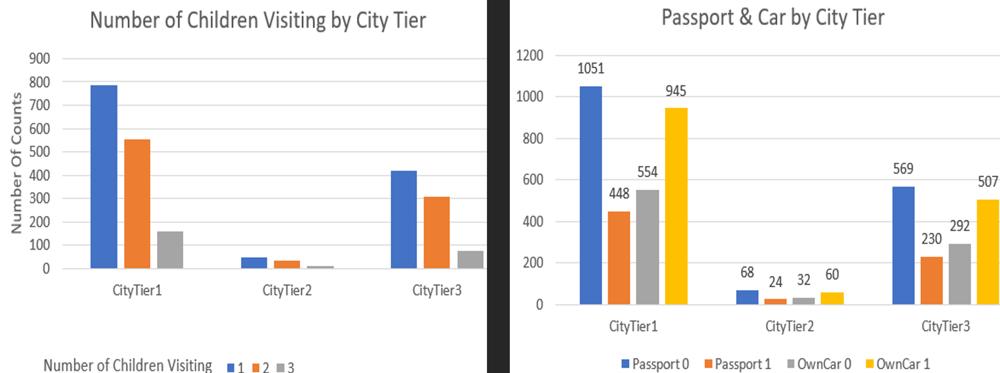

# **Social Media Analysis: From Data to Advertising Campain Decisions**
 
---
## **Background:** 
  Kat Lincoln's new single, Sealed Kiss🗡️, will be released on March 31st, 2025. As part of RadMedia's promotional strategy, the campaign includes content creation, merchandise research, networking, and exposure tactics. The main goal is to maximize the reach and engagement of both the song and the artist within the allocated budget.  
  The company aims to leverage targeted ads for this single, making it essential to understand Kat's current social media audience.

## **Why This Project?** 
  Social media analytics provide powerful insights that can guide effective advertising spending. 
  This project transforms raw data into actionable strategies to ensure the advertisement budget delivers maximum results. 
  It also offers a real-world application of data analysis skills, inviting readers to explore the journey of turning data into marketing gold.

## **What Readers Will Gain?** 
👋Great! I am glad you are still here. By diving into this project, readers will gain:
1.	A clear understanding of Kat Lincoln’s current social media performance.
2.	Insights into the best-performing content and audience demographics.
3.	Data-driven recommendations for targeted advertising and engagement.

## **Key Takeaways:** 
&nbsp;&nbsp;&nbsp;&nbsp;&nbsp;_  **Instagram** has the highest follower count, while Spotify has the most influence in reach and interaction. 
&nbsp;&nbsp;&nbsp;&nbsp;&nbsp;_  **Reels** are the top-performing content type on Instagram for both views and interactions. 
&nbsp;&nbsp;&nbsp;&nbsp;&nbsp;_  The most active audience demographic is **males aged 25-34**, with the least engagement from **females aged 55-64**. 
&nbsp;&nbsp;&nbsp;&nbsp;&nbsp;_  Key markets include **Los Angeles, New York City, Moscow, Lagos, Jakarta, Brazil, and Delhi**. 

## **The Data** 
Data was collected from Instagram, Facebook, Spotify, YouTube, and TikTok, primarily covering the last 28 days. 
Key metrics include Views, Reach, Engagement, and Interaction, with demographics broken down by age, gender, and location.
    
---

## **The Analysis and Commentary** 

### **Period:**  
Content sorted by oldest to newest for all platforms (FB 	=	Facebook, Inst	=	Instagram, TT	=	TikTok) 
&nbsp;&nbsp;&nbsp;&nbsp;&nbsp;&nbsp;&nbsp;&nbsp;&nbsp;&nbsp;&nbsp;&nbsp;&nbsp;&nbsp;&nbsp;&nbsp;&nbsp;&nbsp;&nbsp;&nbsp;&nbsp;&nbsp;&nbsp;&nbsp;&nbsp;&nbsp;&nbsp;&nbsp;&nbsp;&nbsp; 

### **Platform Performance:**
&nbsp;&nbsp;&nbsp;&nbsp;&nbsp;&nbsp;&nbsp;&nbsp;&nbsp;&nbsp;&nbsp;&nbsp;&nbsp;&nbsp;&nbsp;&nbsp;&nbsp;&nbsp;&nbsp;&nbsp;&nbsp;&nbsp;&nbsp;&nbsp;&nbsp;&nbsp;&nbsp;&nbsp;&nbsp;&nbsp;  
&nbsp;&nbsp;&nbsp;&nbsp;&nbsp;&nbsp;&nbsp;&nbsp;&nbsp;&nbsp;&nbsp;&nbsp;&nbsp;&nbsp;&nbsp;&nbsp;&nbsp;&nbsp;&nbsp;&nbsp;&nbsp;&nbsp;&nbsp;&nbsp;&nbsp;&nbsp;&nbsp;&nbsp;&nbsp;&nbsp;  
The attribute is not the same since Spotify is mainly a platform for streaming music.  Below is how I merge the data: 
&nbsp;&nbsp;&nbsp;&nbsp;&nbsp;&nbsp;&nbsp;&nbsp;&nbsp;&nbsp;Follower&nbsp;&nbsp;&nbsp;&nbsp;&nbsp;&nbsp;&nbsp;&nbsp;&nbsp;&nbsp;&nbsp;&nbsp;&nbsp;->&nbsp;&nbsp;Follower 
&nbsp;&nbsp;&nbsp;&nbsp;&nbsp;&nbsp;&nbsp;&nbsp;&nbsp;&nbsp;Listener&nbsp;&nbsp;&nbsp;&nbsp;&nbsp;&nbsp;&nbsp;&nbsp;&nbsp;&nbsp;&nbsp;&nbsp;&nbsp;&nbsp;->&nbsp;&nbsp;&nbsp;Reach 
&nbsp;&nbsp;&nbsp;&nbsp;&nbsp;&nbsp;&nbsp;&nbsp;&nbsp;&nbsp;Streams&nbsp;&nbsp;&nbsp;&nbsp;&nbsp;&nbsp;&nbsp;&nbsp;&nbsp;&nbsp;&nbsp;&nbsp;&nbsp;&nbsp;->&nbsp;&nbsp;&nbsp;Engaged 
&nbsp;&nbsp;&nbsp;&nbsp;&nbsp;&nbsp;&nbsp;&nbsp;&nbsp;&nbsp;Saved + Playlist&nbsp;&nbsp;->&nbsp;&nbsp;Interaction 
   -  **Instagram**: Most followers (11,790), with Reels outperforming other content. 
   -  **Facebook**: high engagement but a smaller reach than Instagram and Spotify. 
   -  **Spotify**: Exceptional in reach or listener (1,348) and interaction (1,444). 
   -  **YouTube** & **TikTok**: Limited data, with room for growth. 

### **Instagram Overview:**
&nbsp;&nbsp;&nbsp;&nbsp;&nbsp;&nbsp;&nbsp;&nbsp;&nbsp;&nbsp;&nbsp;&nbsp;&nbsp;&nbsp;&nbsp;&nbsp;&nbsp;&nbsp;&nbsp;&nbsp;&nbsp;&nbsp;&nbsp;&nbsp;&nbsp;&nbsp;&nbsp;&nbsp;&nbsp;&nbsp; 
&nbsp;&nbsp;&nbsp;&nbsp;&nbsp;&nbsp;&nbsp;&nbsp;&nbsp;&nbsp;&nbsp;&nbsp;&nbsp;&nbsp;&nbsp;&nbsp;&nbsp;&nbsp;&nbsp;&nbsp;&nbsp;&nbsp;&nbsp;&nbsp;&nbsp;&nbsp;&nbsp;&nbsp;&nbsp;&nbsp; 
   -  Instagram **Followers** contribute to **59%** view and interaction. 
   -  Among content, **reels** contribute to **27.6%** of view and interaction. 

### **Audience:**
   -  Predominantly **male** audiences across platforms, with **Facebook** showing the most significant gender gap. 
   -  The age group with the **most** engagement is **25-34**. 
   -  **Ms. Angie Stone's Tribute** post performed best overall. 
   
1.	**Demographic by Platform and Age Group:**  

   -  Platform: ranks from highest to lowest percentage of audience 
&nbsp;&nbsp;&nbsp;&nbsp;&nbsp;&nbsp;&nbsp;&nbsp;Instagram, Facebook, Tiktok, and Spotify. 
   -  Gender:  
&nbsp;&nbsp;&nbsp;&nbsp;&nbsp;&nbsp;&nbsp;&nbsp;More male audience than female audience across platform 
&nbsp;&nbsp;&nbsp;&nbsp;&nbsp;&nbsp;&nbsp;&nbsp;Facebook has the biggest gap in gender differences. 
   -  Age group:  Rank from highest to lowest number of audiences 
&nbsp;&nbsp;&nbsp;&nbsp;&nbsp;&nbsp;&nbsp;&nbsp;25-34, 35-44, 45-54, 18-24, 55-64, lastly 65+ 

2.	**High-Interest Countries:**   
&nbsp;&nbsp;&nbsp;&nbsp;St. Kitts and Nevis faces the highest interest rate of 3.68%, with 165 loans totaling $32M disbursed and $40M repaid.</li>

3.	**Correlations in Repayment & Rates:**
	-	Positive correlation: Higher **repayments** are linked to higher service charge rates.
	-	Negative correlation: Larger **borrower obligations** correspond to lower service charge rates.    

### **Most Active Time:**

### **Content:**

---
## **Main Takeaways:** 
RadMedia should
  - Double down on high-performing content types like Reels and video interviews
  - Prioritize marketing efforts on Instagram and Spotify, as these platforms show the strongest performance.
  - Strategically schedule ads and posts during peak engagement times, mainly in the morning and early evening.
  - Focusing on the most engaged markets and fine-tuning messaging to appeal to males aged 25-34 can significantly enhance the campaign's impact.
  - Craft targeted ads in high-engagement cities: Los Angeles and New York City in the USA, European countries, Moscow in Russia, Lagos in Nigeria, Monrovia in Liberia, Jakarta in Indonesia, Brazil, and Delhi in India. 

## **Call to Action:** 
  - 🔜 Stay tuned as RadMedia rolls out targeted ads for Sealed Kiss! We'll share exciting A/B testing results and dive deeper into what strategies work best. 
  - 🔜 All thoughts, comments, tips, and ideas are welcome. 
  - 🔜 Follow along to see how data-driven insights shape real-world marketing success!
  - 🔜 If you or someone you know wants to hire a data analyst, let’s talk! 
  

#### **The Dashboard:** [Linked Tableau Dashboard](https://public.tableau.com/app/profile/quy.tran4833/viz/DashBoard_17376769592380/Dashboard1?publish=yes) 
I began by exploring the dataset to understand the distribution of variables and identify any missing values. Visualizations were created to observe trends and correlations between variables. Statistical analyses, including chi-square tests and stepwise regression, were conducted to determine significant predictors of product uptake. 

##### Cities in tier 1  
- The largest [product taken](https://public.tableau.com/app/profile/quy.tran4833/viz/TravelProject-ProductTypebyNo_TripsPersonChildren/ProdTaken-IncomebyCityTier?publish=yes) 
- The lowest average income and the highest [number of trips](https://public.tableau.com/app/profile/quy.tran4833/viz/TravelProject-ProductTypebyNo_TripsPersonChildren/NumberofTrips-AgebyCityTier?publish=yes) 

##### Cities in tier 3   
- The highest average monthly income 
  
#### [King Product](https://public.tableau.com/app/profile/quy.tran4833/viz/TravelProject-Income-Product/IncomevsProductPitchedbyCityTier?publish=yes) visitors are: 

- The smallest group
- The least frequent travelers
- Older
- Highest average monthly income
- Likelier to live in **tier 1** cities
- Preferred property star of **3.47** 

#### [Basic Product](https://public.tableau.com/app/profile/quy.tran4833/viz/TravelProject-ProductTypebyProdTakenPropStar/ProductTypebyProdTakenPropStar?publish=yes) visitors are: 
- The largest group
- The most frequent travelers
- Youngest [visitors](https://public.tableau.com/app/profile/quy.tran4833/viz/TravelProject-ProductTypebyNo_TripsPersonChildren/ProductTypebyNo_TripsPersonChildren?publish=yes)
- Taken the most product (552)
- Preferred property star of **3.58**   

### **Predict Whether a Prod Taken** 
 

#### **Chi-Squares Analysis** – [R studio Code file](https://github.com/Qtt4423/Trip-and-Travel-Project/blob/main/1-DVsProdTaken/Travel%20Project-ProdTakenDV.R)
 
**Result:** 
 
- **Passport**:
  - **81%** of customers did not take a product.
  - **29%** of customers have passports.
  - Most customers with no passport did not take a product. 
- **Marital Status**:
  - Married couples have the highest impact
  - Didn't take a product: 41%
  - Taken a product: 7% 
- **Designation**:
  - Largest Group: 30% Manager who did not take a product.
  - Executive purchased the most product (12%). 
- **Product Pitch**:
  - Deluxe Products get pitched the most but 2nd place in success in sales.
  - Basic Products have the highest (12%) of success in sales.  

#### **Stepwise Regression - Best Fit Model:**– [Python- Jupyter Note Book file](https://github.com/Qtt4423/Trip-and-Travel-Project/blob/main/1-DVsProdTaken/ProdTakenContinuousStepwise.ipynb)

 

#### **Summary**:

##### **Marketing Information:** 
  - Was pitched Basic and Deluxe packages with executives’ designation
  - Receive pitch duration above 30s.
  - Take an average of 3.4 trips 
  
##### **Customer Profile:** 
  - Have an average Age of above 30
  - Either single or married couples
  - Have monthly Income above 35000
  - Have a passport, preferably  

### **Characteristics of Customers Who Took a Product** 
#### Predict No. of Trip & Person Visiting:– [R studio Code file](https://github.com/Qtt4423/Trip-and-Travel-Project/blob/main/2-DVsTripVisitorProdTaken-1/ProTaken-Trip-VisistorsDVsObservation.R) -- [Manova File](https://github.com/Qtt4423/Trip-and-Travel-Project/blob/main/2-DVsTripVisitorProdTaken-1/ProdTakenMANOVA.R) 

#### **Stepwise Regression– Best Fit Model:** - [Python- Jupyter Note Book file](https://github.com/Qtt4423/Trip-and-Travel-Project/blob/main/2-DVsTripVisitorProdTaken-1/VisitorOccupationStepWise.ipynb)

**Filter**: Under 10 trips 
**Continuous Variables**: Age, Preferred Property Star, Number of follow-ups and children visiting 

#### **Marketing Information:** 
  - Self-inquiry type of contact
  - City Tier 1 or 3
  - Either Manager preferably, or AVP or Executive Designation also performs well.
  - Preferred Property Star of 4 or 5
  - Pitch Satisfaction Score of 3 
  
#### **Customer Profile:** 
  - Married or unmarried status
  - Age range of 37 - 47 and 54 - 56. (On average, take more than 4 trips)
  - High number of children visiting. The more children, the higher the number of trips and visitors.  

### **Characteristics of Customers Who Did Not Take a Product** - [GitHub directory folder](https://github.com/Qtt4423/Trip-and-Travel-Project/tree/main/3-DVsTripVisitorProdNotTaken-0) 

#### **Marketing Information:** 
 - Are pitched with either Standard, Deluxe, or Super Deluxe products.
 - Receive the above 2 follow-ups, which yield similar to 4 follow-ups and above.
 - Although 5 and 6 followed yield slightly higher results, not much. 
 
#### **Customer Profile:** 
 - In their 30s and 60s travel with most visitors. The older the customers are, the more trips they take.
 - Travel with children. The higher the number of children, the higher the number of trips and visitors.
 - Have an average monthly income of 20-30 thousand.  

### **Predicting Sale Index** - [GitHub Directory File](https://github.com/Qtt4423/Trip-and-Travel-Project/tree/main/4-TravelFocusGroup/SaleIndex)  

#### Create Sale Index = Number of Trips * Person Visiting + Prod Taken
**Highest Sale Index Pivot Table:** 

 

  - Small Business, Basic Product for freelancers 
 
  - Small Business, Basic Product for freelancers
  - Pitch Satisfaction Score of 3 with a pitch duration shorter than 18 with a Preferred Property Star of 3.
  - Interestingly, except for the Pitch Satisfaction Score of 3, all other Pitch Satisfaction Scores have a Preferred Property Star of 5. 
 
  - Single who travels with an average of 3 children with a Monthly Income Range under 200.  

#### **Predicting Sale Index - Machine Learning**
 

#### **Focus on customers who:**
 - Monthly income group above 20thousand
 - Travel with Children
 - At least 30 years of age 

 

 

#### **Citi Tiers Analysis:**
 - Tier 1: 100,000 and more population, Metropolitan center, densely populated, most developed, and higher living expense. Mumbai 12M population.
 - Tier 2: 50,000 to 99,999 population, Urban center, fastest growing tier.
 - Tier 3: 20,000 to 49,999 population, Semi-urban center, the underdeveloped and still evolving. 

 
**Tier 1** cities, with 63% of the customer base, have the highest average sale index even though they have lower average monthly incomes than **tier 3** cities. 

 
•	The more children visit, the more often they travel in all tiers (1 to 3).
•	The majority of customers do not have a passport and own a car.   
&nbsp;&nbsp;&nbsp;&nbsp;--> This insight suggests that they can benefit from local destinations.  

---
## **Concise Summary:**
Insights led me to believe that a well-targeted marketing approach, informed by data analysis, can significantly enhance sales and customer satisfaction: 

### **✅Marketing Factors:** 
 - Product Type: Basic and Deluxe packages are more appealing.
 - Customer Role: Executives show higher interest.
 - Pitch Length: Presentations over 30 seconds are more effective.
 - Travel Frequency: Customers averaging 3.4 trips are more inclined to buy. 
 
### **✅Customer Demographics:** 
 - Age: Over 30 years old.
 - Marital Status: Both singles and married individuals.
 - Income: Monthly earnings above 35,000.
 - Passport Ownership: Having a passport increases purchase likelihood. 
 
### **✅Target Segments:** 
 - Location: Residents of Tier 1 and Tier 3 cities.
 - Job Titles: Managers, Assistant Vice Presidents, and Executives.
 - Property Preferences: Those favoring 4 or 5-star accommodations.
 - Age Groups: Individuals aged 37-47 and 54-56.
 - Family Travelers: Customers traveling with multiple children. 

## **Call to Action:**
  - 🔜 If you found this article insightful, let’s connect on LinkedIn! ✍️  
  - 🔜 I’d love to hear your thoughts or answer any questions about the project.. 
  - 🔜 If you or someone you know wants to hire a data analyst, let’s talk! 
  

