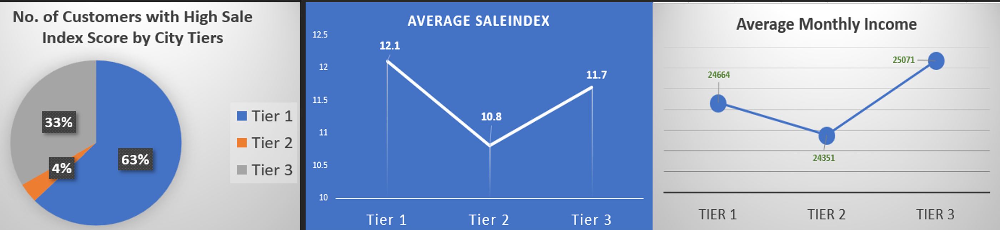

## **The Algorithm of Escape: A Statistical Dive from Passport to Crafting Perfect Vacations Packages**
 
---
**Background:** 
  Does the thought of a vacation 🛫 make your heart 💓 sing like mine? I often daydream about moments from my past vacations with sandy beaches 🐬 and mountain 🚞 retreats. If you’ve ever traveled through vacation packages, you will know the trick is finding the right one for your trip🧳.  But have you ever wondered how travel companies create the perfect vacation packages tailored just for you? I recently embarked on a project to explore this question and uncover how data can help a travel company refine its offerings👏.

**Why THIS Project?:** 
  The motivation behind this project was both personal and professional. As someone who loves traveling👙, I’ve always been curious about how companies know which vacation packages to promote. The travel industry is increasingly competitive, and I wanted to understand how data can enhance marketing strategies✍️. This project was unique because it aimed to optimize a company’s marketing budget and create tailored experiences for potential travelers🛄.

**What Readers Will Gain:** 
- 👋In this article, you will learn how data analytics can refine marketing strategies to shape the experience of 5,725 children and 4,888 adult travelers. We’ll uncover key customer insights, discover what influences purchasing decisions, and explore surprising findings that challenge conventional wisdom.🫰🻠
- 👉Key Takeaways:
  - Pitch duration, designation, and marital status significantly impact whether a customer purchases a vacation package.
  - Children are a strong driving force for Sale.
  - Investing more in single and Tier 2 customer groups with local products can yield better marketing results.

**The Data:** [Link](https://www.kaggle.com/datasets/ndalziel/massachusetts-public-schools-data)
  - 🗂️ nearly 4,900 Rows-Records
  - 🗂️	20  Columns-Attributes
  - **Software used:** Python, R-studio, Excel, Tableau  
    
    **Customer Attribute:** 
      -  **Nominal Categorical Variables:** Gender, Marital Status, Occupation, Own Car, Passport
      -  **Discrete Quantitative Variable:** Customer ID, Age, Number of Children Visiting, Number of Person Visiting
      -  **Continuous Quantitative Variable:** Monthly Income 
      
    **Product Attribute:**
      -  **Nominal Categorical Variables:** Designation, Product Pitched, Type of Contact
      -  **Ordinal Categorical Variables:** City Tier, Preferred Property Star, ProdTaken
      -  **Discrete Quantitative Variable:** Number of Followups, Number of Trips, Pitch Satisfaction Score
      -  **Continuous Quantitative Variable:** Duration of Pitch 

---
**The Analysis and Commentary:**  
**1. Visuals and Insights**
**The Dashboard:** [Linked Tableau Dashboard](https://public.tableau.com/app/profile/quy.tran4833/viz/DashBoard_17376769592380/Dashboard1?publish=yes) 
I began by exploring the dataset to understand the distribution of variables and identify any missing values. Visualizations were created to observe trends and correlations between variables. Statistical analyses, including chi-square tests and stepwise regression, were conducted to determine significant predictors of product uptake. 

 

  - Cities in tier 1 have the largest product taken, with the lowest average income and the highest number of trips, followed by tier 3, which has the highest average monthly income.   
  - King Product customers have the highest average monthly income and are likelier to live in tier 3 cities. 
  - Basic Product attracts the most extensive customer base, especially among children, and welcomes the most visitors. Its youthful clientele and the highest average Property Star rating distinguishes itself.   

**2. Predict Whether a Prod Taken** 
 

**Chi-Squares Analysis** – [R studio Code file](https://github.com/Qtt4423/Trip-and-Travel-Project/blob/main/1-DVsProdTaken/ProdTakenContinuousStepwise.ipynb)
 
- Result: 
 

**Stepwise Regression - Best Fit Model:**  [Python- Jupyter Note Book file](/Trip-and-Travel-Project/1-DVsProdTaken/ProdTakenContinuousStepwise.ipynb)
 

**Summary**:
 - Marketing Information:
  - Was pitched Basic and Deluxe packages with executives’ designation
  - Receive pitch duration above 30s.
  - Take an average of 3.4 trips
 - Customer Profile:
  - Have an average Age of above 30
  - Either single or married couples
  - Have monthly Income above 35000
  - Have a passport, preferably  

**3. Characteristics of Customers Who Took a Product** 
Predict No. of Trip & Person Visiting: [R-Studio File] (/Trip-and-Travel-Project/2-DVsTripVisitorProdTaken-1/ProTaken-Trip-VisistorsDVsObservation.R), [Manova File](/Trip-and-Travel-Project/2-DVsTripVisitorProdTaken-1/ProdTakenMANOVA.R) 

 

**Stepwise Regression– Best Fit Model:** [Python- Jupyter Note Book file](/Trip-and-Travel-Project/2-DVsTripVisitorProdTaken-1/VisitorOccupationStepWise.ipynb) 
Filter: Under 10 trips 
Continuous Variables: Age, Preferred Property Star, Number of follow-ups and children visiting 
Characters of Customers Take a Product
 **Marketing Information:**
  - Self-inquiry type of contact
  - City Tier 1 or 3
  - Either Manager preferably, or AVP or Executive Designation also performs well.
  - Preferred Property Star of 4 or 5
  - Pitch Satisfaction Score of 3
 **Customer Profile:**
  - Married or unmarried status
  - Age range of 37 - 47 and 54 - 56. (On average, take more than 4 trips)
  - High number of children visiting. The more children, the higher the number of trips and visitors.  

**4. Characteristics of Customers Who Did Not Took a Product** [GitHub directory folder](/Trip-and-Travel-Project/3-DVsTripVisitorProdNotTaken-0)
 **Marketing Information:**
 - Are pitched with either Standard, Deluxe, or Super Deluxe products.
 - Receive the above 2 follow-ups, which yield similar to 4 follow-ups and above.
 - Although 5 and 6 followed yield slightly higher results, not much.
 **Customer Profile:**
 - In their 30s and 60s travel with most visitors. The older the customers are, the more trips they take.
 - Travel with children. The higher the number of children, the higher the number of trips and visitors.
 - Have an average monthly income of 20-30 thousand.  

**5. Predicting Sale Index ** [GitHub Directory File](/Trip-and-Travel-Project/4-TravelFocusGroup/SaleIndex)  
Create Sale Index = Number of Trips * Person Visiting + Prod Taken
**Highest Sale Index Pivot Table:** 

 
  - Small Business, Basic Product for freelancers 

 
  - Small Business, Basic Product for freelancers
  - Pitch Satisfaction Score of 3 with a pitch duration shorter than 18 with a Preferred Property Star of 3.
  - Interestingly, except for the Pitch Satisfaction Score of 3, all other Pitch Satisfaction Scores have a Preferred Property Star of 5. 

 
  - Single who travels with an average of 3 children with a Monthly Income Range under 200.  

**Predicting Sale Index - Machine Learning**
 

**Focus on customers who:**
 - Monthly income group above 20thousand
 - Travel with children
 - At least 30 years of age 

 

 

 - Tier 1: 100,000 and more population, Metropolitan center, densely populated, most developed, and higher living expense. Mumbai 12M population.
 - Tier 2: 50,000 to 99,999 population, Urban center, fastest growing tier.
 - Tier 3: 20,000 to 49,999 population, Semi-urban center, the underdeveloped and still evolving. 

 
Tier 1 cities, with 63% of the customer base, have the highest average sale index even though they have lower average monthly incomes than tier 3 cities. 

 
•	The more children visit, the more often they travel in all tiers (1 to 3).
•	The majority of customers do not have a passport and own a car. --> This insight suggests that they can benefit from local destinations.  

---
**Concise Summary:**
Insights led me to believe that a well-targeted marketing approach, informed by data analysis, can significantly enhance sales and customer satisfaction: 
**✅Marketing Factors:** 
 - Product Type: Basic and Deluxe packages are more appealing.
 - Customer Role: Executives show higher interest.
 - Pitch Length: Presentations over 30 seconds are more effective.
 - Travel Frequency: Customers averaging 3.4 trips are more inclined to buy. 
 
**✅Customer Demographics:** 
 - Age: Over 30 years old.
 - Marital Status: Both singles and married individuals.
 - Income: Monthly earnings above 35,000.
 - Passport Ownership: Having a passport increases purchase likelihood. 

**✅Target Segments:** 
 - Location: Residents of Tier 1 and Tier 3 cities.
 - Job Titles: Managers, Assistant Vice Presidents, and Executives.
 - Property Preferences: Those favoring 4 or 5-star accommodations.
 - Age Groups: Individuals aged 37-47 and 54-56.
 - Family Travelers: Customers traveling with multiple children. 

**Call to Action:**
  - 🔜 If you found this article insightful, let’s connect on LinkedIn! ✍️  
  - 🔜 I’d love to hear your thoughts or answer any questions about the project.. 
  - 🔜 If you or someone you know is looking to hire a data analyst, let’s talk! 
  

