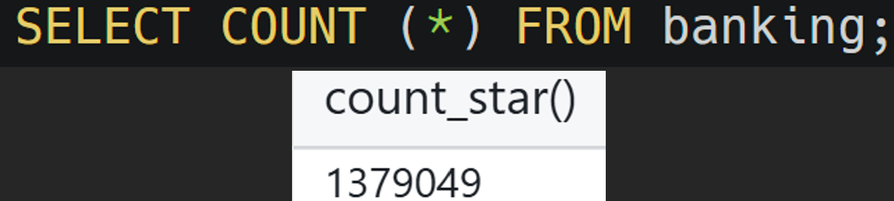
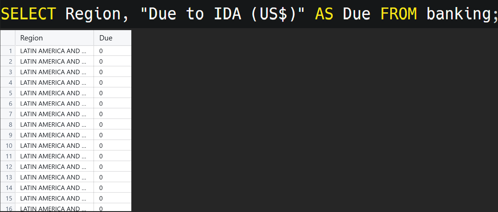
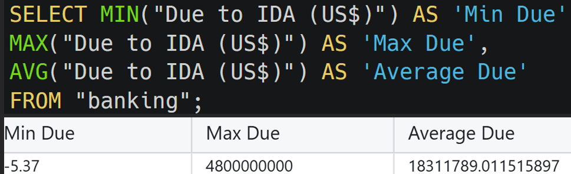
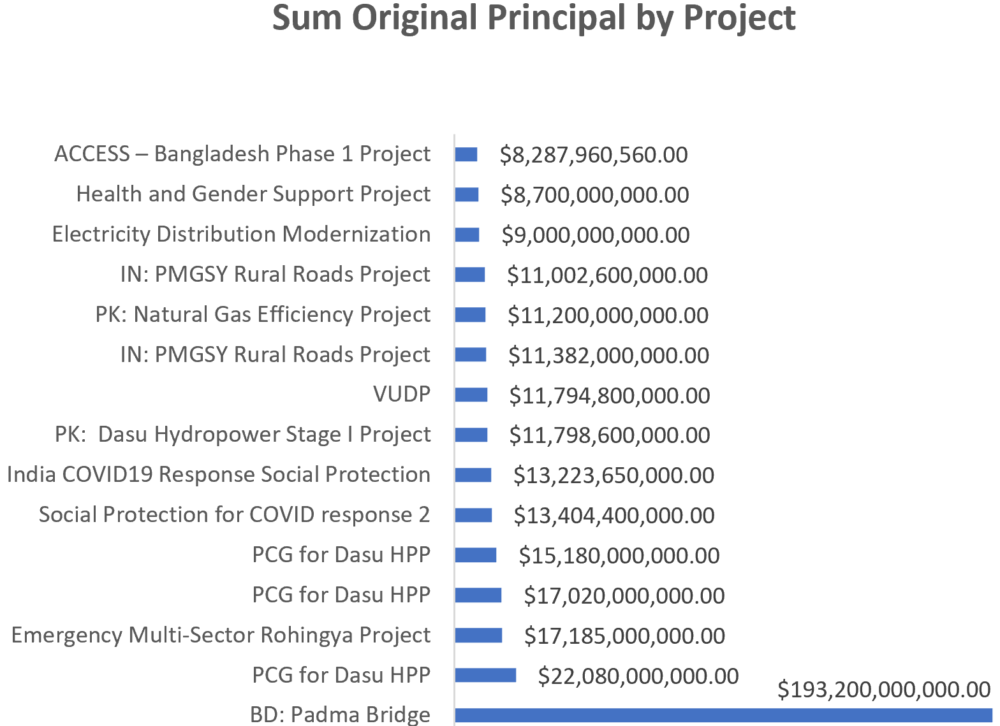

# UNVEILING ECONOMIC OBLIGATIONS LANDSCAPES: 	
###	A COMPREHENSIVE ANALYSIS OF GLOBAL DEBT DYNAMICS 

---

## **Why This Project?**

&nbsp;&nbsp;&nbsp;&nbsp;&nbsp;&nbsp;&nbsp;&nbsp;Following the COVID-19 pandemic 😷, global upheavals such as wars 🪖 and natural disasters have transformed the world’s economic environment. These incidents affect lives globally 🌍, highlighting the importance of understanding the role of loans and finances in international development. Through data analysis 📈, we can identify trends, reveal funding inequalities, and equip decision-makers to develop economic growth and poverty alleviation strategies.

## **Why Should You Pay Attention:**

&nbsp;&nbsp;&nbsp;&nbsp;&nbsp;&nbsp;&nbsp;&nbsp;Whether you’re planning for yourself, your family, or a nation, these insights into 1,379,049 loans with 30 attributes will inspire smarter decisions. Dive into this story of global lending 📊to discover:  
&nbsp;&nbsp;&nbsp;&nbsp;&nbsp;&nbsp;&nbsp;&nbsp;🗺️ Which regions borrow the most?  
&nbsp;&nbsp;&nbsp;&nbsp;&nbsp;&nbsp;&nbsp;&nbsp;📉 How do interest rates vary globally?  
&nbsp;&nbsp;&nbsp;&nbsp;&nbsp;&nbsp;&nbsp;&nbsp;📊 What’s the connection between repayment and service charges?  

## **Key Findings at a Glance** 🚀

#####	**Top Borrowers by loan amount:**

&nbsp;&nbsp;&nbsp;&nbsp;&nbsp;&nbsp;&nbsp;&nbsp;Organization:   
&nbsp;&nbsp;&nbsp;&nbsp;&nbsp;&nbsp;&nbsp;&nbsp;&nbsp;&nbsp;&nbsp;&nbsp;&nbsp;&nbsp;&nbsp;&nbsp;&nbsp;&nbsp;&nbsp;&nbsp;&nbsp;&nbsp;&nbsp;&nbsp;The Ministry of Finance   
&nbsp;&nbsp;&nbsp;&nbsp;&nbsp;&nbsp;&nbsp;&nbsp;Region:   
&nbsp;&nbsp;&nbsp;&nbsp;&nbsp;&nbsp;&nbsp;&nbsp;&nbsp;&nbsp;&nbsp;&nbsp;&nbsp;&nbsp;&nbsp;&nbsp;&nbsp;&nbsp;&nbsp;&nbsp;&nbsp;&nbsp;&nbsp;&nbsp;South Asia, Africa   
&nbsp;&nbsp;&nbsp;&nbsp;&nbsp;&nbsp;&nbsp;&nbsp;Country:   
&nbsp;&nbsp;&nbsp;&nbsp;&nbsp;&nbsp;&nbsp;&nbsp;&nbsp;&nbsp;&nbsp;&nbsp;&nbsp;&nbsp;&nbsp;&nbsp;&nbsp;&nbsp;&nbsp;&nbsp;&nbsp;&nbsp;&nbsp;&nbsp;India, Bangladesh, Pakistan, Vietnam, Nigeria 
    
#####	**Interest Rates:**

&nbsp;&nbsp;&nbsp;&nbsp;&nbsp;&nbsp;&nbsp;&nbsp;St. Kitts and Nevis:    
&nbsp;&nbsp;&nbsp;&nbsp;&nbsp;&nbsp;&nbsp;&nbsp;&nbsp;&nbsp;&nbsp;&nbsp;&nbsp;&nbsp;&nbsp;&nbsp;📈 Highest interest rate at 3.68%   
&nbsp;&nbsp;&nbsp;&nbsp;&nbsp;&nbsp;&nbsp;&nbsp;&nbsp;&nbsp;&nbsp;&nbsp;&nbsp;&nbsp;&nbsp;&nbsp;(165 loans worth $32M disbursed, $40M repaid).   
&nbsp;&nbsp;&nbsp;&nbsp;&nbsp;&nbsp;&nbsp;&nbsp;Africa:🌍  
&nbsp;&nbsp;&nbsp;&nbsp;&nbsp;&nbsp;&nbsp;&nbsp;&nbsp;&nbsp;&nbsp;&nbsp;&nbsp;&nbsp;&nbsp;&nbsp;The lowest average interest rate is 0.09% (2,891 loans).   

#####	**Service Charge Rate Correlations:**

&nbsp;&nbsp;&nbsp;&nbsp;&nbsp;&nbsp;&nbsp;&nbsp;Higher repayments correlate with higher service charge rates.   
&nbsp;&nbsp;&nbsp;&nbsp;&nbsp;&nbsp;&nbsp;&nbsp;Lower borrower obligations tend to have lower rates.   

#####	**Project-Specific Insights:**

&nbsp;&nbsp;&nbsp;&nbsp;&nbsp;&nbsp;&nbsp;&nbsp;St. Kitts and Nevis:   
&nbsp;&nbsp;&nbsp;&nbsp;&nbsp;&nbsp;&nbsp;&nbsp;&nbsp;&nbsp;&nbsp;&nbsp;&nbsp;&nbsp;&nbsp;&nbsp;&nbsp;&nbsp;&nbsp;&nbsp;&nbsp;&nbsp;&nbsp;&nbsp;Only 1 project (AG DEV Support) with a service charge rate >1.   
&nbsp;&nbsp;&nbsp;&nbsp;&nbsp;&nbsp;&nbsp;&nbsp;Macedonia:  
&nbsp;&nbsp;&nbsp;&nbsp;&nbsp;&nbsp;&nbsp;&nbsp;&nbsp;&nbsp;&nbsp;&nbsp;&nbsp;&nbsp;&nbsp;&nbsp;&nbsp;&nbsp;&nbsp;&nbsp;&nbsp;&nbsp;&nbsp;&nbsp;🚩59% of projects have a 3.4% interest rate.   
&nbsp;&nbsp;&nbsp;&nbsp;&nbsp;&nbsp;&nbsp;&nbsp;Kenya:  
&nbsp;&nbsp;&nbsp;&nbsp;&nbsp;&nbsp;&nbsp;&nbsp;&nbsp;&nbsp;&nbsp;&nbsp;&nbsp;&nbsp;&nbsp;&nbsp;&nbsp;&nbsp;&nbsp;&nbsp;&nbsp;&nbsp;&nbsp;&nbsp;Leads in guaranteed loans (1,248).   
&nbsp;&nbsp;&nbsp;&nbsp;&nbsp;&nbsp;&nbsp;&nbsp;Afghanistan:     
&nbsp;&nbsp;&nbsp;&nbsp;&nbsp;&nbsp;&nbsp;&nbsp;&nbsp;&nbsp;&nbsp;&nbsp;&nbsp;&nbsp;&nbsp;&nbsp;&nbsp;&nbsp;&nbsp;&nbsp;&nbsp;&nbsp;&nbsp;&nbsp;Dominates in grants (12,302).   
&nbsp;&nbsp;&nbsp;&nbsp;&nbsp;&nbsp;&nbsp;&nbsp;India:  
&nbsp;&nbsp;&nbsp;&nbsp;&nbsp;&nbsp;&nbsp;&nbsp;&nbsp;&nbsp;&nbsp;&nbsp;&nbsp;&nbsp;&nbsp;&nbsp;&nbsp;&nbsp;&nbsp;&nbsp;&nbsp;&nbsp;&nbsp;&nbsp;Tops in credits (69,805).   

##	The Data:📊

&nbsp;&nbsp;&nbsp;&nbsp;&nbsp;&nbsp;&nbsp;&nbsp;The International Development Association (IDA) is crucial in aiding the world’s poorest nations. The [data set](https://financesone.worldbank.org/ida-statement-of-credits-grants-and-guarantees-historical-data/DS00976) analyzed comes from the World Bank’s IDA Statement of Credits, Grants, and Guarantees - Historical Data and offers detailed insights into global lending practices. 

## Tools & Techniques🛠️

<ul>
  <li>SQL: 
      Extracted and aggregated the dataset with precision.</li>
  <li>Tableau & Excel: 
      Visualized trends to make findings accessible and actionable.</li>
</ul>

**Let's start uncovering the hidden stories behind global loans to understand how they shape economic growth and social development together!** 🌐✨

---

## The Analysis and Commentary:

### **OVER VIEW OF THE DATA**

#####	Return all of the table

&nbsp;&nbsp;&nbsp;&nbsp;&nbsp;&nbsp;&nbsp;&nbsp; 
 

#####	Return the first 5 rows of the table, but only the borrower & due to IDA column 
&nbsp;&nbsp;&nbsp;&nbsp;&nbsp;&nbsp;&nbsp;&nbsp; 
&nbsp;&nbsp;&nbsp;&nbsp;&nbsp;&nbsp;&nbsp;&nbsp;
      
#####	Total number of transactions 
&nbsp;&nbsp;&nbsp;&nbsp;&nbsp;&nbsp;&nbsp;&nbsp;**Row:** 
&nbsp;&nbsp;&nbsp;&nbsp;&nbsp;&nbsp;&nbsp;&nbsp; 
&nbsp;&nbsp;&nbsp;&nbsp;&nbsp;&nbsp;&nbsp;&nbsp;**Column:** 
&nbsp;&nbsp;&nbsp;&nbsp;&nbsp;&nbsp;&nbsp;&nbsp; 
   
### **Payment Timeframe Analysis**

Which was the most recent to pay? 
&nbsp;&nbsp;&nbsp;&nbsp;&nbsp;&nbsp;&nbsp;&nbsp; 
 
&nbsp;&nbsp;&nbsp;&nbsp;&nbsp;&nbsp;&nbsp;&nbsp;&nbsp;&nbsp;&nbsp;&nbsp;&nbsp;&nbsp;&nbsp;&nbsp; 

### **DUE to IDA (US$) Attribute Analysis:**

  **🏆 The Biggest Borrowers:**   
&nbsp;&nbsp;&nbsp;&nbsp;&nbsp;&nbsp;&nbsp;&nbsp;At the forefront, The Ministry of Finance leads with the highest total loan amount, steering resources to tackle financial and developmental challenges. Regionally, South Asia dominates, with Africa following closely, reflecting their significant development needs. 

#####	The top 15 highest organization borrowers** 
&nbsp;&nbsp;&nbsp;&nbsp;&nbsp;&nbsp;&nbsp;&nbsp; 
 

>  🥇The Ministry of Finance has the highest total loan amount. 

#####	Abbreviate one of the column names so it's easier to write 
&nbsp;&nbsp;&nbsp;&nbsp;&nbsp;&nbsp;&nbsp;&nbsp; 

#####	List the top 15 highest Region borrowers:** 

&nbsp;&nbsp;&nbsp;&nbsp;&nbsp;&nbsp;&nbsp;&nbsp; 
&nbsp;&nbsp;&nbsp;&nbsp;&nbsp;&nbsp;&nbsp;&nbsp; 
&nbsp;&nbsp;&nbsp;&nbsp;&nbsp;&nbsp;&nbsp;&nbsp; 

>  🥇South Asia has the highest total loan amount, followed by Africa.

#####	What is the maximum, minimum, and average amount owed to the IDA?** 

&nbsp;&nbsp;&nbsp;&nbsp;&nbsp;&nbsp;&nbsp;&nbsp;  

#####	Overall Impact of Loans:📊
<ul>
  <li>Cumulative Loan Amount: Over $25 trillion, reflecting decades of developmental investments.</li>
  <li>Snapshot Loan Total: Nearly $210 billion in the most recent data—a significant portion of global financial aid.</li>
</ul>
&nbsp;&nbsp;&nbsp;&nbsp;&nbsp;&nbsp;&nbsp;&nbsp;
  
#####	Loan amount to the IDA by Country**: 
 
&nbsp;&nbsp;&nbsp;&nbsp;&nbsp;&nbsp;&nbsp;&nbsp;  
  
>🌟 Top Loan Recipients:   
><ul>
>  <li>🇮🇳 India</li>
>  <li>🇧🇩 Bangladesh</li>
>  <li>🇵🇰 Pakistan</li>
>  <li>🇻🇳 Vietnam</li>
>  <li>🇳🇬 Nigeria</li>
></ul>
&nbsp;&nbsp;&nbsp;&nbsp;&nbsp;&nbsp;&nbsp;&nbsp; 
 
><ul>
>  <li>Haiti has almost a $0 loan amount.</li>
>  <li>Costa Rica has had a big jump of $82,407 in loan amounts.</li>
></ul>

#####	Who has the most loans?**   
&nbsp;&nbsp;&nbsp;&nbsp;&nbsp;&nbsp;&nbsp;&nbsp;**Total Transactions by Country** 
&nbsp;&nbsp;&nbsp;&nbsp;&nbsp;&nbsp;&nbsp;&nbsp; 
  
  
>	**India has the highest number of loans, while World and International Finance Corporation has the lowest amount.**  

&nbsp;&nbsp;&nbsp;&nbsp;&nbsp;&nbsp;&nbsp;&nbsp; 

###  **The Service Charge Rate Puzzle** 💡:

####	Key players in steep rates: 
-	**St. Kitts and Nevis:**   
    <ul>
      <li>📈 Interest rate: 3.68% (highest globally).</li>
      <li>🏦 Loans: 165, with $32M disbursed and $40M repaid.</li>
      <li>💡 Insight: Despite the high rate, repayment amounts exceed disbursed funds—a testament to strategic financial management.</li>
    </ul>
-	**Africa:**   
    <ul>
      <li>🌍 Lowest average interest rate: 0.09% across 2,891 loans.</li>
      <li>🤔 Observation: Low rates help balance the repayment burden for developing nations.</li>
    </ul>

#####	**The High and Low of Service Charges**

   
&nbsp;&nbsp;&nbsp;&nbsp;&nbsp;&nbsp;&nbsp;&nbsp; 
  
<ul>
  <li>St. Kitts and Nevis has the highest Interest rate of **3.68**.</li>
  <li>Africa has the lower Interest rate of **0.09**.</li>
</ul>

#####	Service Charge Rate by Country  
######	**0 interest rate:** 
&nbsp;&nbsp;&nbsp;&nbsp;&nbsp;&nbsp;&nbsp;&nbsp;

######	**Top 10 countries with the lowest interest rate:** 
&nbsp;&nbsp;&nbsp;&nbsp;&nbsp;&nbsp;&nbsp;&nbsp;

######	**Top 10 countries with the highest interest rate:** 
&nbsp;&nbsp;&nbsp;&nbsp;&nbsp;&nbsp;&nbsp;&nbsp;

######	Knowing that most countries have an average interest rate **under 2.0**, I filter the graph to show better variation. 
    

###  CRITICAL INFLUENCERS ASSESSMENT Analysis:
####	**Geospatial Data Analysis:**🯠The Project Insights That Matter 
#####	**St. Kitts and Nevis**
The AG Dev Support Project is the sole project with a service charge rate >1, spotlighting a unique financial model.
#####	**Macedonia:** 🚩  
  59% of projects have an interest rate of 3.4%, making it a region of high financial strain.
#####	**Bangladesh:** 
  The Padma Bridge Project emerges as a powerhouse, with the region's highest active Original Principal loan amount.

######	**How many loans do St. Kitts and Nevis have?**
&nbsp;&nbsp;&nbsp;&nbsp;&nbsp;&nbsp;&nbsp;&nbsp;
  
######	**How many loans does Africa have?**
&nbsp;&nbsp;&nbsp;&nbsp;&nbsp;&nbsp;&nbsp;&nbsp;
  
######	**Return all column groups by country with a Service Charge Rate greater than 1 for St. Kitts and Nevis**
&nbsp;&nbsp;&nbsp;&nbsp;&nbsp;&nbsp;&nbsp;&nbsp;
######	Return selected columns groups by project name with a Service Charge Rate greater than 1 for St. Kitts and Nevis**
 

&nbsp;&nbsp;&nbsp;&nbsp;&nbsp;&nbsp;&nbsp;&nbsp;&nbsp;&nbsp;&nbsp;&nbsp;&nbsp;&nbsp;&nbsp;&nbsp;

>St. Kitts and Nevis‘s disbursed loan amount is almost $32 million, and $40 million is repaying the loan amount.
>AG DEV Support is the only project under this category.

  
&nbsp;&nbsp;&nbsp;&nbsp;&nbsp;&nbsp;&nbsp;&nbsp;

🔄 Correlations That Speak Volumes:

-	**Repayment Amount** ↔️ Service Charge Rate:   
	-	A **positive correlation** suggests that higher repayments often incur higher service charge rates.   
	-	This highlights the importance of negotiating better repayment terms to manage financial burdens.
-	**Borrower Obligation** ↔️ Service Charge Rate:   
	-	A **negative correlation** reveals that larger borrower obligations tend to result in lower service charge rates.
	-	Could this be a hidden incentive for bigger development projects?  

   
  
   

######	Return selected columns group by Project Name and Credit Status for **St. Kitts and Nevis** with Service Charge Rate greater than 1**
   
  Only the **AG Dev Support Project** has a service charge rate greater than 1 in St. Kitts and Nevis. 

#####	**Macedonia and North Macedonia**
-	**59%** of Projects in Macedonia have a high interest rate of **3.4**.
-	**70%** of Projects in North Macedonia have a high interest rate of **3.39**

######	Macedonia, the former Yugoslav Republic of: 
&nbsp;&nbsp;&nbsp;&nbsp;&nbsp;&nbsp;&nbsp;&nbsp; 
&nbsp;&nbsp;&nbsp;&nbsp;&nbsp;&nbsp;&nbsp;&nbsp;&nbsp;&nbsp;&nbsp;&nbsp;&nbsp;&nbsp;&nbsp;&nbsp;

######	North Macedonia, the former Yugoslav Republic of: 
&nbsp;&nbsp;&nbsp;&nbsp;&nbsp;&nbsp;&nbsp;&nbsp; 
&nbsp;&nbsp;&nbsp;&nbsp;&nbsp;&nbsp;&nbsp;&nbsp;&nbsp;&nbsp;&nbsp;&nbsp;&nbsp;&nbsp;&nbsp;&nbsp;

###  Project Attribute Analysis

#####	**Top 20 Highest Original Principal Amount (US$) Project:**    
   
&nbsp;&nbsp;&nbsp;&nbsp;&nbsp;&nbsp;&nbsp;&nbsp;&nbsp;&nbsp;&nbsp;&nbsp;&nbsp;&nbsp;&nbsp;&nbsp;  

>	SAC II, followed by IN: Elementary Education (SAC II) Project, ranked the highest in the original principal amount.   

 
#####	**Return all columns for SAC II and Elementary Education (SSA II) project**   
-	**South Asia** has a higher SAC II loan amount than Africa.   
-	Meanwhile, **Africa** has a higher original principal amount than the loan amount. 

   
   
    
  
###  Credit Status Analysis

#####	**Top 15 projects** for countries with the highest loan amount to the IDA with active credit status in **India, Bangladesh, Pakistan, and Vietnam** 
&nbsp;&nbsp;&nbsp;&nbsp;&nbsp;&nbsp;&nbsp;&nbsp; 
&nbsp;&nbsp;&nbsp;&nbsp;&nbsp;&nbsp;&nbsp;&nbsp;  

**Bangladesh** has the highest total active Original Principal, while **India** has the highest active loan amount due.  
**BD: The Padma Bridge project** has a significantly higher total active Original Principal loan amount than other projects. 

&nbsp;&nbsp;&nbsp;&nbsp;&nbsp;&nbsp;&nbsp;&nbsp;&nbsp;&nbsp;&nbsp;&nbsp;&nbsp;&nbsp;&nbsp;&nbsp; 

#####	🏗️ **Types of Loans Across the Globe:**

-	**Guarantees**: 🇰🇪 **Kenya** leads with 1,248 loans.   
-	**Grants**: 🇦🇫 **Afghanistan** dominates with 12,302 loans.   
-	**Credits**: 🇮🇳 **India** takes the crown with 69,805 loans.   

&nbsp;&nbsp;&nbsp;&nbsp;&nbsp;&nbsp;&nbsp;&nbsp;&nbsp;&nbsp;&nbsp;&nbsp;&nbsp;&nbsp;&nbsp;&nbsp;

#####	**List the countries with the highest count of loans for each of the following "Guarantees," "Grants," or "Credits"**
Clasification starts with the letters of the credit Number IDs
<ul>
  <li>Guarantees (IDAB and IDAG): Kenya at 1248 number of loans </li>
  <li>Grants (IDAD, IDAH and IDAE): Afghanistan at 12302 number of loans</li>
  <li>Credits (all others): India at 69805</li>
</ul>
    

 
---

## The Bigger Picture:

&nbsp;&nbsp;&nbsp;&nbsp;&nbsp;&nbsp;&nbsp;&nbsp;This analysis is more than just numbers—it's a window into how nations grow, rebuild, and thrive. Behind every loan lies a story of ambition, resilience, and innovation. 

## Re-emphasizing Key Takeaways 🌟📊:

1.	**Top Borrowers & Regions:**
	-	The Ministry of Finance holds the highest total loan amount.
	-	South Asia leads regional allocations, followed by Africa.
	-	🇮🇳 India, 🇧🇩 Bangladesh, and 🇵🇰 Pakistan top the list of loan recipients.
2.	**High-Interest Countries:**   
&nbsp;&nbsp;&nbsp;&nbsp;St. Kitts and Nevis faces the highest interest rate of 3.68%, with 165 loans totaling $32M disbursed and $40M repaid.</li>

3.	**Correlations in Repayment & Rates:**
	-	Positive correlation: Higher **repayments** are linked to higher service charge rates.
	-	Negative correlation: Larger **borrower obligations** correspond to lower service charge rates.    
	
>These findings 💡highlight the significance of strategic financial planning to manage repayment burdens and secure favorable loan termsğŸ‘, offering valuable insights for 🌠policymakers and decision-makers✅.  

## Where Do We Go From Here 🚀✨:

&nbsp;&nbsp;&nbsp;&nbsp;🔜	👌Use these insights to inform financial and policy decisions, negotiate smarter loan terms, and promote sustainable global🌠growth. 
&nbsp;&nbsp;&nbsp;&nbsp;🔜	✍️ Dive deeper into how financing drives projects that change lives. 
&nbsp;&nbsp;&nbsp;&nbsp;🔜	🗨️ Engage & Share your takeaways, 💡ideas for further analysis. 
&nbsp;&nbsp;&nbsp;&nbsp;🔜	Collaborate with Me: Reach out for collaboration or work opportunities—I’m ready to dive into data with you! 🌟 
  

